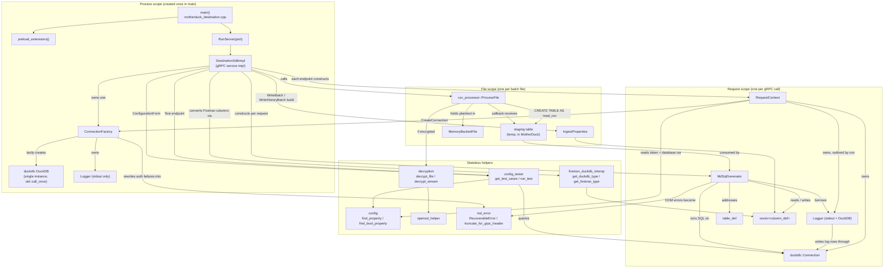
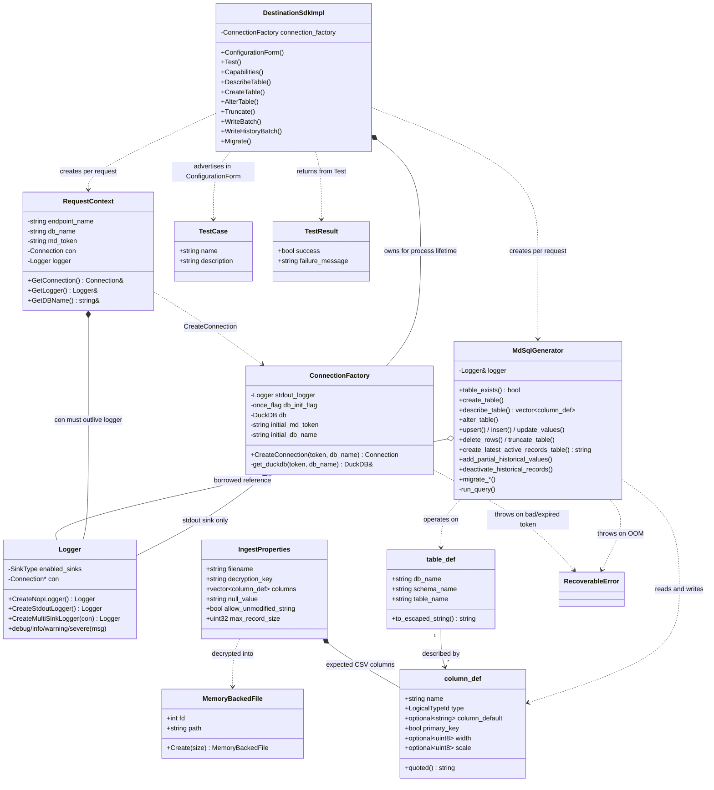
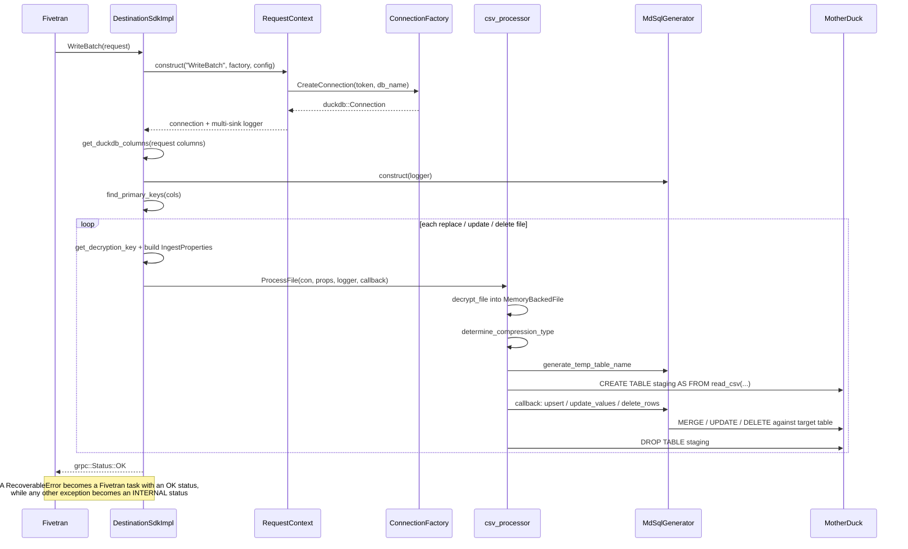

# Architecture

How the objects and functions in this connector relate to each other. The connector is a gRPC
server implementing the Fivetran Partner SDK `DestinationConnector` service, backed by a DuckDB
connection to MotherDuck.

## Entity map

Every entity belongs to one of three lifetimes, which is the main thing to keep straight when
reading the code: process-scoped state is shared across all concurrent requests, request-scoped
state is created and destroyed per gRPC call, and file-scoped state lives only for the duration of
one batch file.

## Data structures

## Request lifecycle

`WriteBatch` is the most complete path, exercising nearly every entity:

## Endpoint to SQL operation mapping

Every endpoint follows the same shape: construct a `RequestContext`, construct an `MdSqlGenerator`
over its logger, then dispatch to one or more generator methods.

| Endpoint | Primary collaborators |
| --- | --- |
| `ConfigurationForm` | `config` property names, `config_tester::get_test_cases` |
| `Test` | `RequestContext` (connecting *is* the auth test), `config_tester::run_test`, `extract_readable_error` |
| `Capabilities` | none; hardcodes CSV batch format |
| `DescribeTable` | `table_exists`, `describe_table`, `get_fivetran_type` |
| `CreateTable` | `create_schema_if_not_exists_with_retries`, `create_table`, `get_duckdb_type` |
| `AlterTable` | `alter_table` (which picks `alter_table_in_place` or `alter_table_recreate`) |
| `Truncate` | `table_exists`, `truncate_table` |
| `WriteBatch` | `csv_processor::ProcessFile` plus `upsert` / `update_values` / `delete_rows` |
| `WriteHistoryBatch` | `create_latest_active_records_table`, `deactivate_historical_records`, `add_partial_historical_values`, `insert`, `delete_historical_rows`, `drop_latest_active_records_table` |
| `Migrate` | `drop_table`, `drop_column_in_history_mode`, `copy_table`, `copy_column`, `copy_table_to_history_mode`, `rename_table`, `rename_column`, `add_column`, `add_defaults`, `add_column_in_history_mode`, `update_column_value`, `migrate_*` sync-mode switches |

## Lifetime and concurrency constraints

These relationships are load-bearing and easy to break:

- `duckdb::DuckDB` is initialized exactly once per process. `ConnectionFactory::get_duckdb` throws
  if a later request arrives with a different token or database name.
- Inside `RequestContext`, `con` is declared before `logger` so the connection outlives the logger.
  The logger holds a raw `duckdb::Connection*` and writes its log rows through it.
- `MdSqlGenerator` holds a `Logger&`, so it must not outlive the `RequestContext` it was built from.
- Up to `MAX_PARALLEL_REQUESTS` (8) `WriteBatch` calls can be in flight at once, which is what
  bounds `MAX_RECORD_SIZE_DEFAULT` (24 MiB) against the container memory limit.
- `~RequestContext` rolls back any transaction still open and not in autocommit mode.
- In `WriteHistoryBatch`, `lar_table_name` is declared outside the `try` block so the
  latest-active-records table can be dropped from the `catch` blocks.
